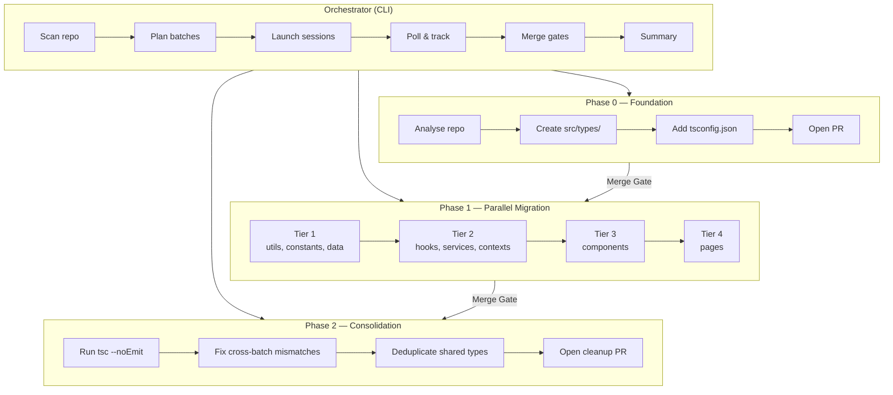

# Design — ShopDirect TypeScript Migration Orchestrator

This document covers the internal architecture, design decisions, and implementation details behind the orchestrator. For a high-level overview, see [README.md](README.md).

## Detailed Architecture



## Module Breakdown

| File | Responsibility |
|---|---|
| `migrate.py` | CLI entry point, three-phase orchestration, session lifecycle, merge gates, Ctrl+C cleanup |
| `scanner.py` | Walks `src/` for JS/JSX files, groups by directory, assigns dependency tiers |
| `devin_client.py` | Thin wrapper around the Devin v3 API (sessions, playbooks, messages, termination) |
| `github_client.py` | GitHub REST API client for PR reads, merges, mergeability polling, and token validation |
| `progress.py` | Rich terminal UI — builds the live progress table with per-batch status |
| `playbook.md` | Migration rules uploaded to Devin as a playbook (file conversion, typing rules, constraints) |

## Dependency Tiering

The scanner assigns files to tiers based on their top-level directory under `src/`. Tiers encode a rough dependency order — lower tiers have fewer imports from the rest of the codebase, so they can be migrated first without breaking downstream consumers.

| Tier | Directories | Rationale |
|---|---|---|
| 1 | `utils`, `constants`, `data`, `mocks` | Pure utilities and data — no React, no business logic imports |
| 2 | `hooks`, `services`, `contexts` | Mid-level modules that may import from tier 1 |
| 3 | `components` | React components that import from tiers 1–2 |
| 4 | `pages` | Top-level pages that compose components from tier 3 |

Tiers execute sequentially. Within a tier, batches run concurrently up to `--max-parallel` (default: 2). A configurable cooldown (`--tier-cooldown`, default: 45s) is inserted between tiers to let the Devin platform fully release session slots before the next tier launches — without this, the first session of a new tier often hits a 429 rate limit. This means tier 1 batches all finish, the cooldown elapses, and then tier 2 starts, preventing both import breakage and session-slot contention.

## Session Lifecycle

Each Devin session follows this lifecycle from the orchestrator's perspective:

```
create_session() → poll loop → terminal state → PR URL discovery
```

1. **Create** — `_create_session_with_retry()` sends the prompt, playbook, repo, and ACU cap. Retries on 5xx (3x, 15s apart) and 429 (6x, 60s apart).
2. **Poll** — Every 30 seconds, `get_session()` checks status. Transient errors (5xx, connection drops) are tolerated up to 3 consecutive failures before marking blocked.
3. **Terminal detection** — A session is terminal when status is `exit`, `error`, `suspended`, or `running` with `status_detail == "finished"`. Sessions in `waiting_for_user` with an open PR are also treated as complete.
4. **PR discovery** — The API may not populate `pull_requests` on the exact poll where the session terminates. Up to 6 extra polls (10s apart) retry discovery.

## Merge Gates

Merge gates are blocking checkpoints between phases. They ensure dependent phases see a consistent codebase.

**Auto-merge mode (default):**
- Parses the PR URL to extract `owner/repo/number`
- Polls `GET /repos/{owner}/{repo}/pulls/{number}` until `mergeable == true`
- Squash-merges via `PUT /repos/{owner}/{repo}/pulls/{number}/merge`
- Handles `mergeable == null` (GitHub still computing), merge conflicts, and CI state
- Fails fast on 401/403 (permission errors) — no point retrying
- Falls back to manual prompt if merge fails

**Manual mode (`--no-auto-merge`):**
- Prints all PR URLs and pauses with `input()` until the operator confirms they've merged

## Resilience Strategy

The orchestrator handles four categories of API failure:

| Error | Detection | Retry strategy |
|---|---|---|
| 5xx (502, 503, etc.) | HTTP status code on `requests.HTTPError` | 3 retries, 15s apart (session creation); next poll cycle (polling) |
| 429 rate limit | HTTP 429 status code | 6 retries, 60s apart — waits for concurrent session slots. Inter-tier cooldown (45s default) reduces occurrence. |
| Connection errors | Exception type name (`RemoteDisconnected`, `ConnectionResetError`, etc.) + exception chain + string matching | Same as 5xx — 3 retries, 15s apart |
| Blocked batch with valid PR | Batch `status == "blocked"` but `pr_url` exists | PR still included in merge gate auto-merge |

All retry logic uses dual logging (`print()` + `console.print()`) to ensure visibility even when Rich's `Live` context suppresses normal output.

## Upfront Validation

Before spending time on foundation, the orchestrator validates the GitHub token:

1. `GET /repos/{owner}/{repo}` — checks the token can access the repo at all
2. Inspects `permissions.push` in the response — confirms write access for merging
3. On failure, prints actionable error messages covering both classic PATs (`repo` scope) and fine-grained PATs (`Contents: Read and write`)
4. Falls back to `--no-auto-merge` mode if validation fails — the run continues, just without auto-merge

## Prompt Design

Each phase uses a different prompt strategy:

**Foundation** — Instructs Devin to analyse the entire repo, identify shared domain entities, and create canonical interfaces in `src/types/`. Explicitly forbids renaming files or migrating application code.

**Batch migration** — Lists the exact files to migrate. Instructs Devin to import shared types from `src/types/` instead of redefining them. Includes 13 numbered rules covering renames, typing, verification, and scope constraints.

**Consolidation** — Instructs Devin to run `tsc --noEmit` repo-wide, resolve cross-batch mismatches, and replace duplicated local interfaces with imports from the canonical module. Scoped to type-related fixes only.

All sessions receive the same `playbook.md` which defines file conversion rules, typing rules, verification steps (tsc + tests), constraints (no business logic changes), and expected output format.
