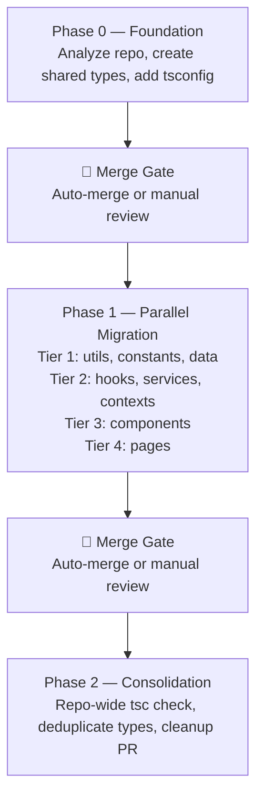

# ShopDirect TypeScript Migration Orchestrator

A Python CLI that automates large-scale JavaScript-to-TypeScript migrations using the Devin API. Instead of converting files one at a time or dumping a single massive PR, the orchestrator breaks the migration into a structured three-phase workflow — establishing shared type contracts first, migrating files in parallel batches, and reconciling cross-batch inconsistencies at the end.

The problem it solves: manual JS-to-TS migrations are slow, error-prone, and produce inconsistent types across a codebase. Parallel AI sessions make it fast, but naively parallelizing creates a worse problem — fragmented, duplicated type definitions that don't agree with each other. This tool solves both by imposing structure on the migration process itself.

## Why Devin

Devin is used here as a scoped execution engine, not a code generator. Each Devin session receives a focused prompt, a playbook defining migration rules, and a bounded set of files. The session runs `tsc --noEmit`, verifies compilation, runs tests, and opens a PR — all within a sandboxed environment. The orchestrator never touches application code directly; it owns planning, lifecycle, and merge sequencing while Devin owns analysis, conversion, and verification.

## Architecture

> See [DESIGN.md](DESIGN.md) for detailed internal architecture, module breakdown, and implementation decisions.



> [!IMPORTANT]
> **Your team stays in control.** Both merge gates support two modes: fully automated (default) for overnight unattended runs, or manual review (`--no-auto-merge`) where the orchestrator pauses and waits for engineer approval before proceeding. For a first pilot, we recommend `--no-auto-merge` so your team can review foundation types and batch PRs before anything merges. As trust builds, switch to auto-merge for hands-free overnight migrations.

**Three phases, two merge gates:**

1. **Phase 0 — Foundation** — A single Devin session analyses the repo, identifies shared domain entities (`Product`, `CartItem`, `Order`, etc.), creates canonical interfaces in `src/types/`, and adds `tsconfig.json`. Its PR must merge before any batch starts.

2. **Phase 1 — Parallel migration** — Files are grouped into batches by directory and assigned to dependency tiers (utilities → hooks/services → components → pages). Batches within a tier run concurrently up to `--max-parallel`. Each session imports from `src/types/` instead of redefining shared types. All batch PRs must merge before consolidation.

3. **Phase 2 — Consolidation** — A final Devin session runs `tsc --noEmit` across the entire repo, resolves remaining type mismatches, replaces any duplicated interfaces with imports from the canonical module, and opens a cleanup PR.

The orchestrator manages all session lifecycle, polling, PR discovery, and merge sequencing. Devin sessions are scoped workers that receive a prompt and produce a PR.

## What I Built vs What Devin Did

**The orchestrator owns:** repo scanning, batch planning, tier-based dependency ordering, session lifecycle management, progress tracking, merge gates between phases, auto-merge via GitHub API, transient error retries, rate limit backoff, Ctrl+C cleanup, and the live terminal UI.

**Devin owns:** repo analysis, shared type identification, foundation code generation, per-batch file conversion, TypeScript verification (`tsc --noEmit`), test execution, PR creation, and post-migration consolidation.

The orchestrator decides *what* to migrate, *when*, and *in what order*. Devin decides *how* to migrate each unit of work and is responsible for producing code that compiles.

## How It Works

1. **Scan** — Walks `src/` for `.js`/`.jsx` files, groups them by top-level directory, assigns dependency tiers
2. **Plan** — Produces a tiered batch plan with file counts and execution order
3. **Foundation** — Launches a Devin session to establish shared types and TS config
4. **Merge gate** — Auto-merges the foundation PR (or pauses for manual review)
5. **Batch migration** — Launches concurrent Devin sessions per tier, polling each until completion
6. **Merge gate** — Auto-merges all batch PRs
7. **Consolidation** — Launches a final Devin session to reconcile cross-batch inconsistencies
8. **Summary** — Prints a final status table with all PRs and elapsed time

## Features

### Core Workflow

- **Playbook-driven sessions** — All sessions receive a shared `playbook.md` defining migration rules, uploaded as a Devin playbook
- **Auto-merge between phases** — PRs are squash-merged via the GitHub API at each merge gate, with mergeability polling and CI awareness
- **Manual review mode** (`--no-auto-merge`) — Pauses at merge gates for human review instead of auto-merging
- **PR URL discovery retries** — Extra polls after session completion to catch PR URLs that aren't immediately populated
- **Blocked batch recovery** — Batches marked blocked by transient errors still have their PRs included in auto-merge if a PR was opened before the failure
- **ACU budget caps** — Each session is capped at 10 ACUs to prevent runaway spending

### Reliability / Resilience

- **Transient error retries** — Retries 5xx errors and connection drops (RemoteDisconnected, ConnectionReset, etc.) during both session creation and polling
- **Rate limit handling** — Detects 429 responses from the Devin API and backs off with 60-second retries, waiting for concurrent session slots to free up
- **Upfront token validation** — Validates GitHub token scopes and write access before the first session launches; fails fast with actionable error messages for both classic and fine-grained PATs
- **Needs-input detection** — Alerts the operator when a Devin session is waiting for user input, with a direct link to the session

### Operator Controls

- **Dry-run mode** (`--dry-run`) — Preview the migration plan without launching any sessions
- **Configurable parallelism** (`--max-parallel N`) — Control concurrent sessions per tier (default: 2)
- **Inter-tier cooldown** (`--tier-cooldown N`) — Seconds to wait between tiers for session slots to free up (default: 45)
- **Ctrl+C cleanup** — Catches interrupts and offers to terminate all running Devin sessions in one step
- **Live progress table** — Rich terminal UI showing per-batch status, tier, file counts, PR links, and elapsed time, updated in real-time

## Usage

### Prerequisites

- Python 3.11+
- A Devin API key and org ID
- A GitHub token with write access to the target repo

### Setup

```bash
git clone https://github.com/raghavrajsah/shopdirect-migration.git
cd shopdirect-migration
python -m venv .venv && source .venv/bin/activate
pip install -r requirements.txt
```

### Environment variables

```bash
export DEVIN_API_KEY="your-devin-api-key"
export DEVIN_ORG_ID="your-org-id"
export GITHUB_TOKEN="your-github-token"   # needed for auto-merge
```

### Run

```bash
# Preview the plan
python migrate.py --repo ../shopdirect-frontend --dry-run

# Full migration with auto-merge
python migrate.py \
  --repo ../shopdirect-frontend \
  --frontend-repo-name raghavrajsah/shopdirect-frontend \
  --max-parallel 2

# Manual review mode (pause at merge gates)
python migrate.py \
  --repo ../shopdirect-frontend \
  --frontend-repo-name raghavrajsah/shopdirect-frontend \
  --no-auto-merge
```

## Key Lesson from the Pilot

The first version of this tool ran all migration batches in parallel with no shared type foundation. The result: every batch independently invented its own `Product`, `CartItem`, and `Order` interfaces — slightly different shapes, different property names, incompatible across files. The repo compiled per-batch but fell apart when merged together.

The fix was architectural, not mechanical. Establishing canonical shared type contracts *before* parallelization means every batch imports from a single source of truth. The consolidation phase catches anything that slipped through. This is the difference between running AI sessions and orchestrating them.

## What This Demonstrates

This project is a working example of turning a vague client pain point ("we need to migrate to TypeScript") into an operational, repeatable workflow:

- **Workflow design over code generation** — The value isn't in the TS conversion itself; it's in the orchestration that makes parallel conversion produce coherent results
- **Devin as infrastructure** — Devin sessions are treated as scoped workers with clear inputs and outputs, not as a chatbot
- **Reviewable artifacts** — Every phase produces a reviewable PR, and the workflow is designed around typecheck/test verification plus human checkpoints at merge gates
- **Production-grade resilience** — Transient API failures, rate limits, and connection drops are handled with structured retries, not optimistic happy-path code

## Future Improvements

- **Incremental re-runs** — Resume from the last successful phase instead of restarting from scratch
- ~~**Adaptive parallelism**~~ — *(Partially addressed: default parallelism lowered to 2 and inter-tier cooldown added to prevent 429s. Full adaptive scaling remains a future goal.)*
- **Cross-batch dependency analysis** — Use import graph analysis to assign tiers automatically instead of relying on a static folder-to-tier map
- **Consolidation loop** — Re-run consolidation iteratively until `tsc --noEmit` produces zero errors
- **Multi-repo support** — Extend the orchestrator to handle monorepos or multi-package workspaces
